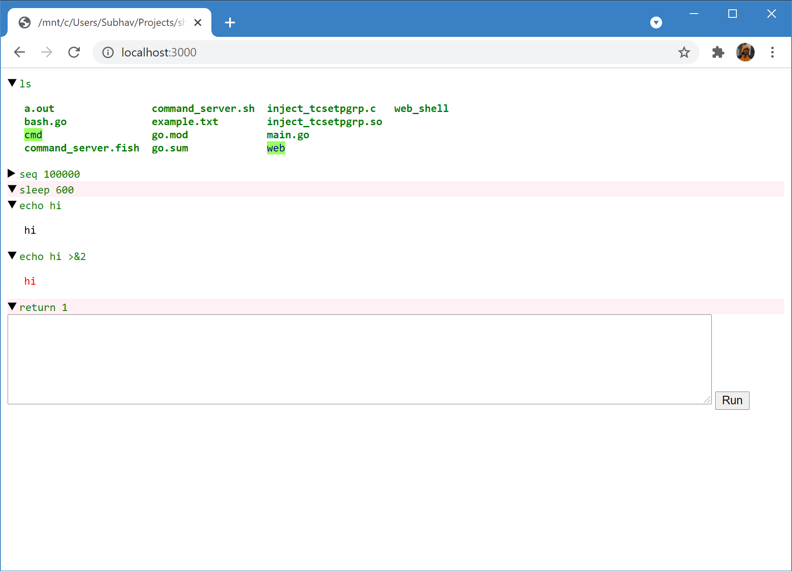

Proof-of-concept shell interface outside a terminal.

This works with bash and the Go sh/interp package.

 

Build with:
```shell
go generate
go build
```

Run:
```shell
./web_shell
# Or, to get rid of the controlling terminal:
# (requires using `kill` to exit)
setsid ./web_shell
```

Clean:
```shell
rm web_shell lib/inject_tcsetpgrp.so
```

Shift-Enter to enter a new line.\
Ctrl-C to interrupt a running command.\
Double-click to collapse a command's output.

It's horrible in many ways. Most notably, the shell interpreter instance
is global.
